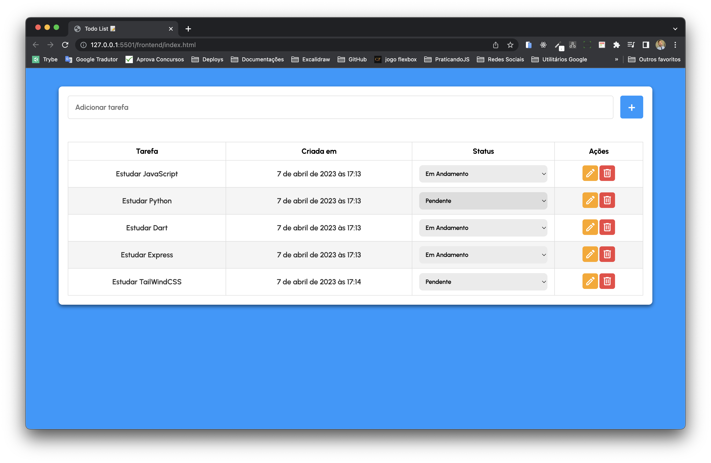

## Todo List Full Stack 👨🏼‍💻📝



---
<details>
<summary><span style="font-size: 1.5rem;"> 👨🏼‍💻 Proposta</span></summary>
  - Criar um todo list Full-stack(Front-end/Back-end); </br>
  - Criar um banco de dados MySQL para alimentar o front-end; </br>
  - Criar um front-end para manipular o banco de dados; </br>
</details>

---
<details>
<summary><span style="font-size: 1.5rem;"> 📝Funcionalidades</span></summary>
  - Adicione uma nova tarefa; </br>
  - Edite uma tarefa existente; </br>
  - Remova uma tarefa existente; </br>
  - Lista de tarefas atualizada dinamicamente.
</details>

----
<details>
<summary><span style="font-size: 1.5rem;"> 💡Tecnologias Utilizadas</span></summary>
  - HTML </br> 
  - CSS </br>
  - MySQL </br>
  - Express </br>
  - Node JS </br>
  - JavaScript
</details>

----

<details>
<summary><span style="font-size: 1.5rem;">💻Pré-requisitos</span></summary>
  - Node.js 14.x </br>
  - MySQL 
</details>

---

#### Como executar o projeto
> ⚠️ É necessário ter um banco de dados MySQL todolist - no final do README contém infos adicionais com alguns dados sobre o db
1. Clone este repositório
````
git clone git@github.com:vitor-nogueira-dev/todolist-fullstack.git
````
2. Na pasta raiz do projeto, execute o seguinte comando para instalar as dependências:
```
npm install
``` 
3. Na pasta backend, execute o seguinte comando para iniciar o servidor:
````
npm start
````
4. Acesse o arquivo `index.html` da aplicação e execute o `Live Server`

---
### Configuração do banco de dados
1. Crie um banco de dados MySQL chamado todolist
````
DROP DATABASE IF EXISTS todolist;
CREATE DATABASE IF NOT EXISTS todolist;

USE todolist;

CREATE TABLE tasks (
  id INT PRIMARY KEY AUTO_INCREMENT,
  title VARCHAR(45) NOT NULL,
  status VARCHAR(45) NOT NULL,
  created_at VARCHAR(45) NOT NULL
);
````
2. Configure as credenciais de acesso ao banco de dados no arquivo .env.
`````
PORT=
MYSQL_HOST=
MYSQL_USER=
MYSQL_PASSWORD=
MYSQL_DB=
`````
3. Execute o script acima para criar a tabela tasks
   
### Contribuições
> 💡Contribuições são bem-vindas! Se você tiver alguma sugestão ou encontrar um bug, por favor, abra uma issue ou envie um pull request.


